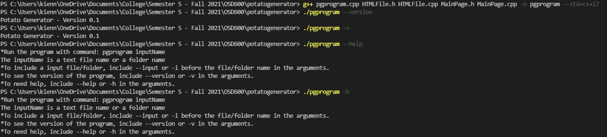
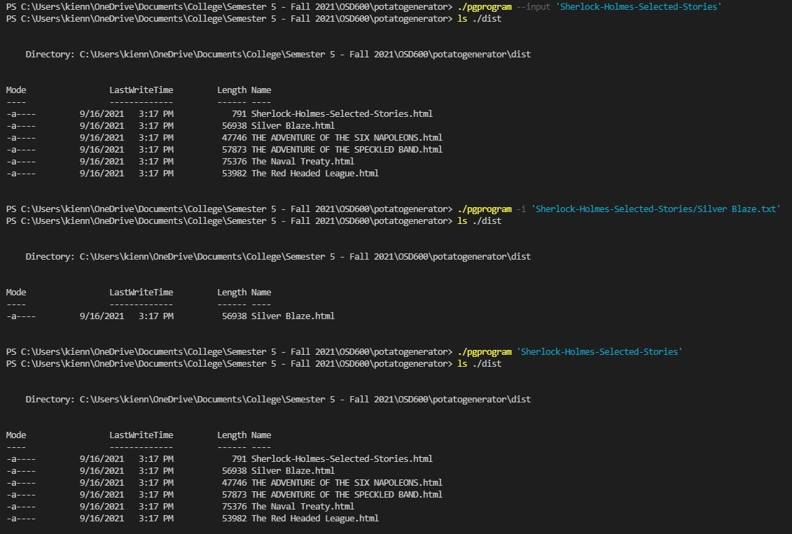

<h1>Potato Generator</h1>
This is a C++ Static Site Generator (SSG) tool.

<h1>Author</h1>
Chi Kien Nguyen

<h1>Features</h1>
<ul>
    <li>With a folder input, the tool creates a main HTML page containing links to each site.</li>
    <li>With a text file input, the tool creates a single HTML page.</li>
    <li>The tool generates h1 tag for title of each site.</li>
    <li>The tool uses stylesheet for better format on websites.</li>
</ul>

<h1>System Requirements</h1>
<ul>
    <li>C++17 Compiler (Visual Studio Code)</li>
    <li>MINGW (Optional)</li>
</ul>

<h1>How To Run</h1>
<h3>Compiling</h3>
g++ pgprogram.cpp HTMLFile.h HTMLFile.cpp MainPage.h MainPage.cpp -o pgprogram --std=c++17
<h3>Without specified arguments</h3>
On CMD, enter command <b>pgprogram <i>fname</i></b>. (Where fname is the name of a file/folder)
<h3>With specified arguments: </h3>
<table>
    <tr>
        <td>Option 1</td>
        <td>Option 2</td>
        <td>Functionality</td>
    </tr>
    <tr>
        <td>--input</td>
        <td>-i</td>
        <td>Specify input argument with file/folder name</td>
    </tr>
    <tr>
        <td>--help</td>
        <td>-h</td>
        <td>See the instructions how to run program</td>
    </tr>
    <tr>
        <td>--version</td>
        <td>-v</td>
        <td>See the updated version of the program</td>
    </tr>
</table>

<h1>Examples</h1>
<h3>Run the program with --help, -h, --version and -v</h3>

<h3>Run the program with --input, -i, and no arguments</h3>

<h1>Generated Websites</h1>
<a href="https://gifted-brattain-2278d4.netlify.app/sherlock-holmes-selected-stories/sherlock-holmes-selected-stories">Websites</a>
<h1>License</h1>
<a href="https://opensource.org/licenses/MIT">MIT License</a>

